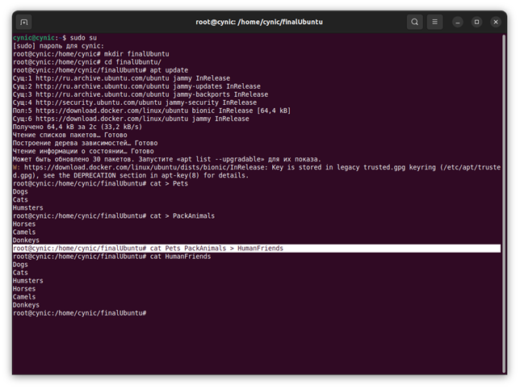
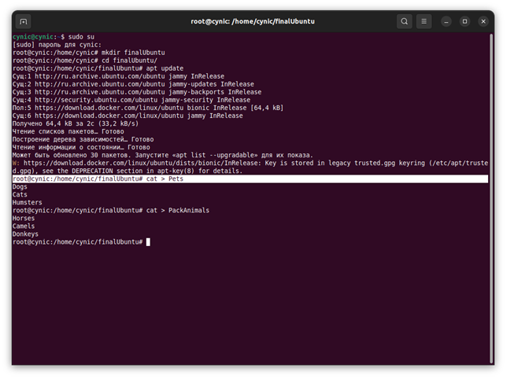
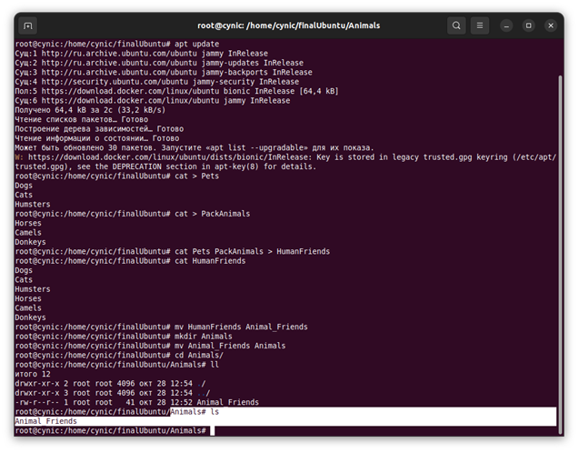
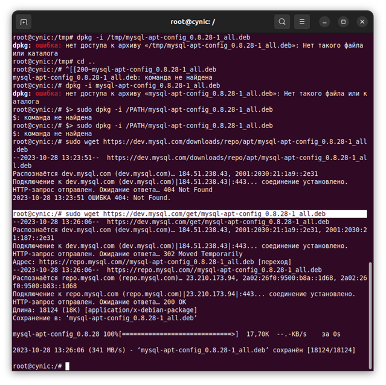
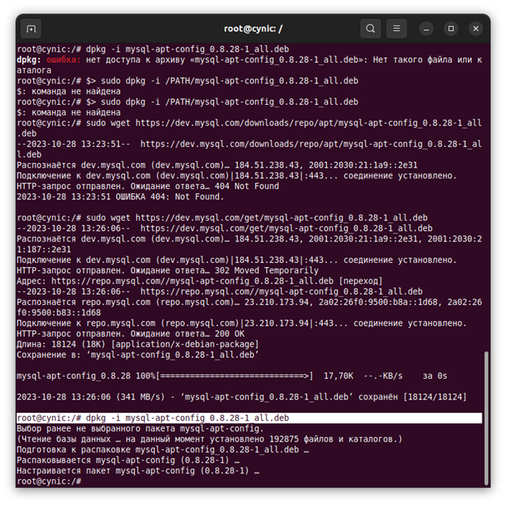
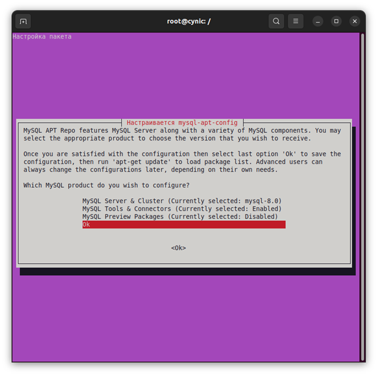
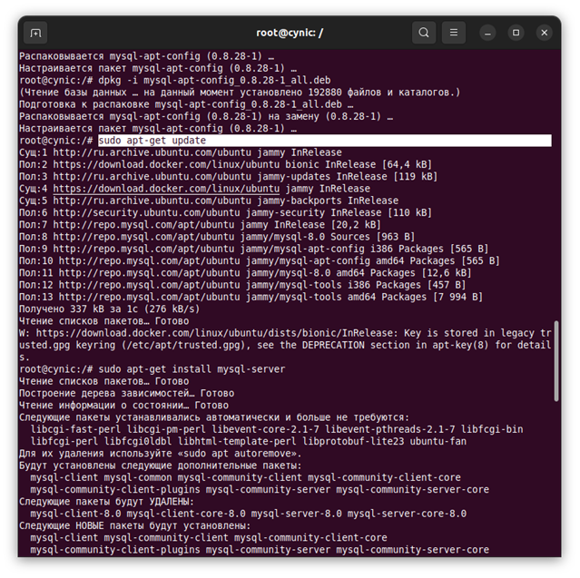
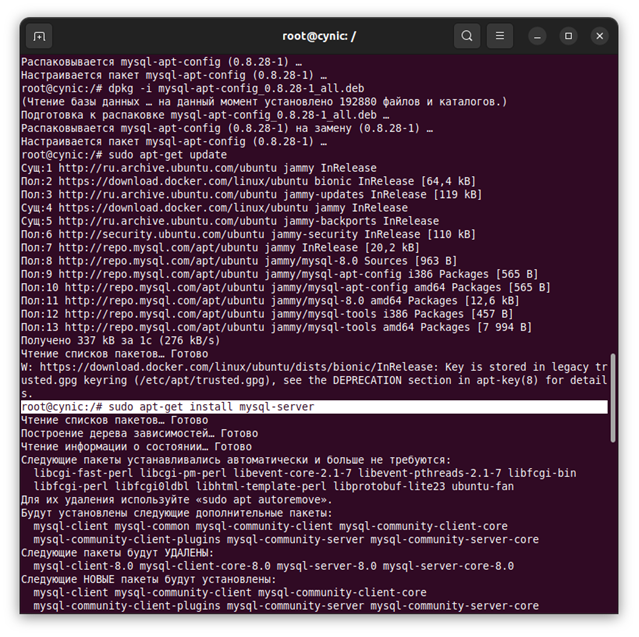
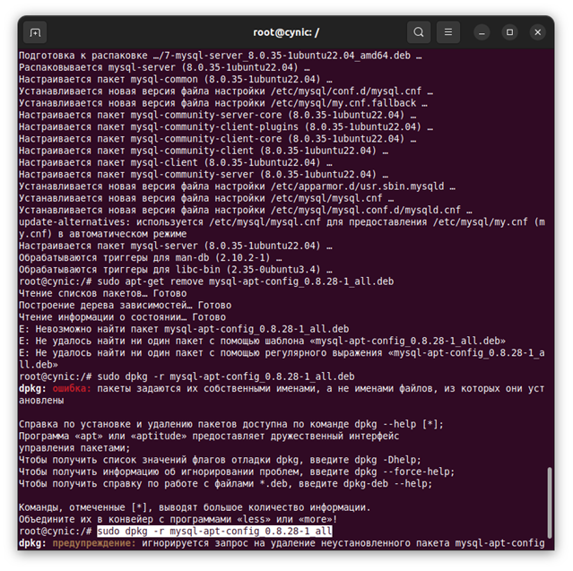
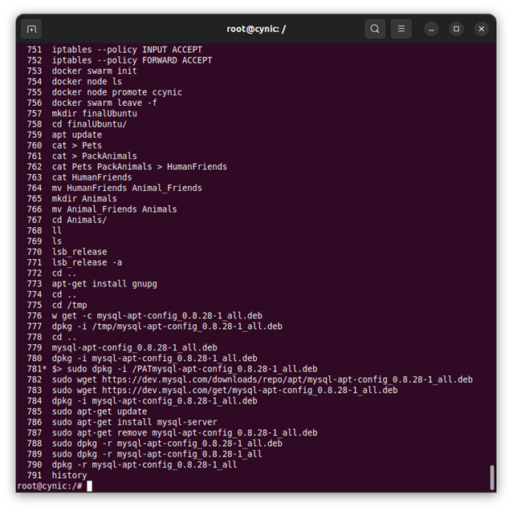

# 1. Создать директорию, переместить файл туда.
### cat > Pets
### cat > PackAnimals
### cat Pets PackAnimals > HumanFriends
### cat HumanFriends
### mv HumanFriends Animal_Friends
### mkdir Animals
### mv Animal_Friends Animals
### cd Animals/
### ls

# 2. Подключить дополнительный репозиторий MySQL. Установить любой пакет из этого репозитория.
# 3. Установить и удалить deb-пакет с помощью dpkg.
# 4. Выложить историю команд в терминале ubuntu.
### apt-get install gnupg
### sudo wget https://dev.mysql.com/get/mysql-apt-config_0.8.28-1_all.deb
### dpkg -i mysql-apt-config_0.8.28-1_all.deb
### sudo apt-get update
### sudo apt-get install mysql-server
### sudo dpkg -r mysql-apt-config_0.8.28-1_all
### history

